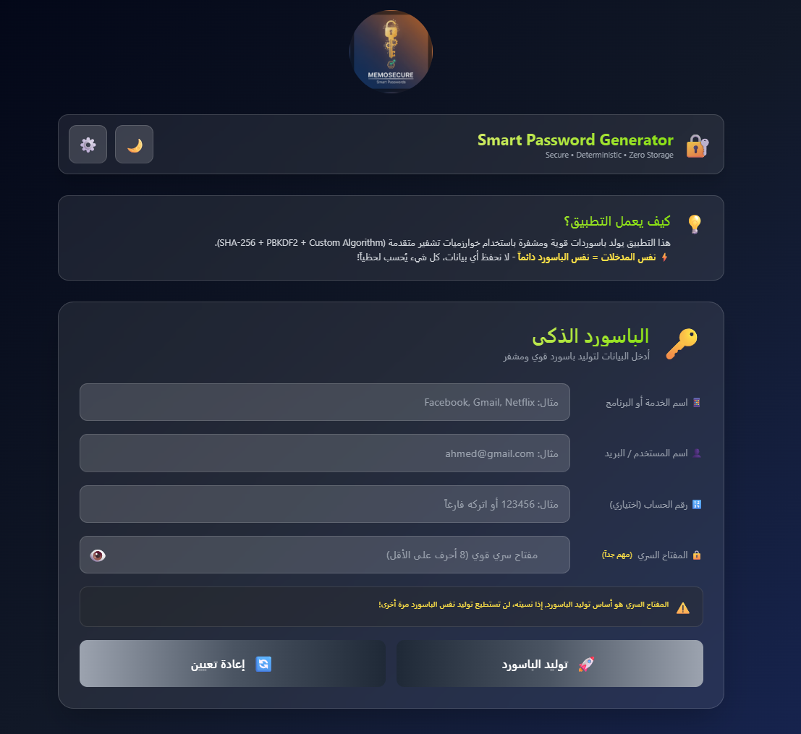
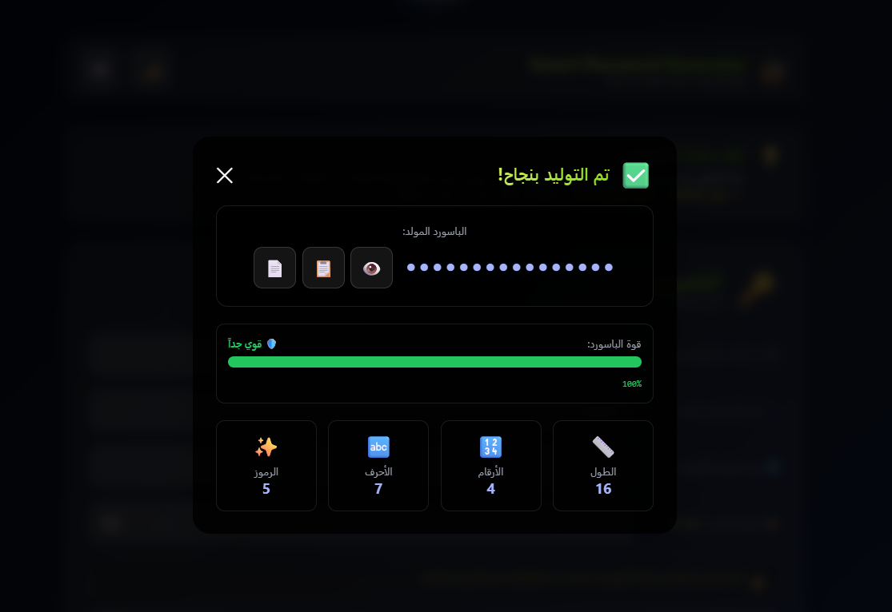
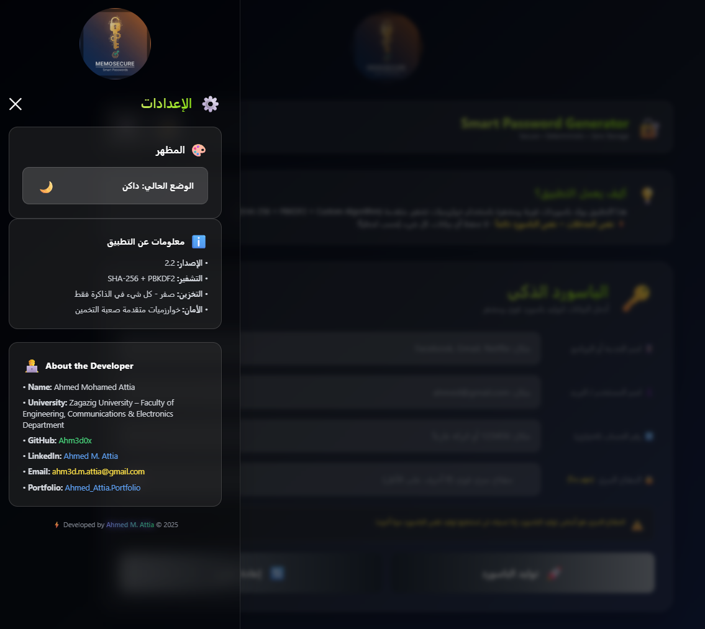

# 🔐 Smart Password Generator

<div align="center">


**A deterministic, secure, and intelligent password generator that creates the same password from the same inputs - with zero data storage!**

[Features](#-features) • [Demo](#-demo) • [How It Works](#-how-it-works) • [Installation](#-installation) • [Usage](#-usage) • [Security](#-security) • [FAQ](#-faq)

</div>

---

## 📋 Table of Contents

- [Overview](#-overview)
- [Key Features](#-features)
- [How It Works](#-how-it-works)
- [Installation](#-installation)
- [Usage Guide](#-usage-guide)
- [Security Details](#-security-details)
- [Technical Specifications](#-technical-specifications)
- [Browser Compatibility](#-browser-compatibility)
- [FAQ](#-frequently-asked-questions)
- [Contributing](#-contributing)
- [License](#-license)
- [Contact](#-contact)

---

## 🌟 Overview

The **Smart Password Generator** is a revolutionary web-based tool that generates strong, unique passwords using advanced cryptographic algorithms. Unlike traditional password managers, this tool:




- ✅ **Never stores your passwords** - Everything is computed in real-time
- ✅ **Deterministic** - Same inputs always produce the same password
- ✅ **Offline capable** - Works without internet after first load
- ✅ **Privacy-focused** - Zero data collection or tracking
- ✅ **Cross-platform** - Works on any device with a web browser

---

## ✨ Features

### 🔒 Security Features

- **Advanced Encryption Algorithms**
  - SHA-256 hash function
  - PBKDF2 key derivation with 100,000 iterations
  - Custom character mixing algorithm
  - Multiple salt layers for enhanced security

- **Strong Password Generation**
  - Minimum 16 characters length
  - Guaranteed character variety (uppercase, lowercase, numbers, symbols)
  - Always starts with a letter (not a number or symbol)
  - Cryptographically secure randomization

- **Zero Storage Policy**
  - No localStorage or sessionStorage usage
  - No cookies or external server communication
  - All data exists in memory only during session
  - Automatic clearing on page unload

### 🎨 User Interface Features

- **Responsive Design**
  - Beautiful glassmorphism effects
  - Smooth animations and transitions
  - Dark/Light theme toggle
  - Mobile-friendly layout
  - Optimized for desktop and mobile screens

- **Smart Input Layout**
  - Adaptive field sizing based on screen size
  - Labels positioned beside inputs on desktop
  - Labels positioned above inputs on mobile
  - Real-time input validation

- **Advanced Features**
  - Copy password button
  - Copy all data button (password + input details)
  - Password strength indicator with visual meter
  - Password statistics (length, numbers, letters, symbols)
  - Toggle password visibility
  - Custom alert modals (no browser alerts)
  - Keyboard shortcuts support

### ⌨️ Keyboard Shortcuts

- `Ctrl/Cmd + K` - Focus on service name field
- `Enter` - Generate password (when focused on any input)
- `Escape` - Close all modals and panels

---

## 🔧 How It Works

### The Algorithm

1. **Input Collection**
   - Service name (e.g., Facebook, Gmail)
   - Username/Email
   - Account number (optional)
   - Secret key (minimum 8 characters)

2. **Hash Generation**
   ```
   Multiple SHA-256 hashes with different salt combinations
   ↓
   PBKDF2 key derivation (1,000 iterations)
   ↓
   Custom character mixing algorithm
   ↓
   Strong password output
   ```

3. **Password Construction**
   - First character: Always a letter (A-Z or a-z)
   - Guaranteed minimum of 2 uppercase letters
   - Guaranteed minimum of 2 lowercase letters
   - Guaranteed minimum of 2 numbers
   - Guaranteed minimum of 2 special symbols
   - Fisher-Yates shuffle algorithm (preserving first letter)
   - Position-based character transformations

4. **Deterministic Output**
   - Same inputs ALWAYS generate the same password
   - No randomness - pure mathematical computation
   - Reproducible across any device or browser

---

## 📥 Installation

### Option 1: Direct Use (Recommended)

Simply open the `index.html` file in any modern web browser. No installation required!

```bash
# Clone the repository
git clone https://github.com/Ahm3d0x/smart-password-generator.git

# Navigate to the directory
cd smart-password-generator

# Open in browser
# Double-click index.html or use a local server
```

### Option 2: Local Server

For best experience, use a local web server:

```bash
# Using Python 3
python -m http.server 8000

# Using Node.js (http-server)
npx http-server

# Using PHP
php -S localhost:8000
```

Then open `http://localhost:8000` in your browser.

### Option 3: Deploy to Web

Deploy to any static hosting service:
- GitHub Pages
- Vercel
- Netlify
- Cloudflare Pages

---

## 📖 Usage Guide

### Basic Usage

1. **Enter Service Name**
   - The name of the website, app, or service
   - Example: `Facebook`, `Gmail`, `Netflix`

2. **Enter Username/Email**
   - Your username or email for that service
   - Example: `ahmed@gmail.com`

3. **Enter Account Number** (Optional)
   - Additional identifier if you have multiple accounts
   - Example: `123456` or leave blank

4. **Enter Secret Key**
   - Your master password (minimum 8 characters)
   - ⚠️ **IMPORTANT**: Remember this key! Without it, you cannot regenerate the same password
   - Use a strong, memorable phrase

5. **Generate Password**
   - Click "توليد الباسورد الآن" (Generate Password Now)
   - Wait for the generation process (about 1 second)
   - Your password will appear in a modal

6. **Copy Password**
   - Click the 📋 button to copy just the password
   - Click the 📄 button to copy password + all input data
   - Use the 👁️ button to show/hide the password

### Advanced Usage

#### Copy All Data Feature

The "Copy All Data" button (📄) copies a formatted text containing:
- Generated password
- Service name
- Username
- Account number
- Secret key
- Password statistics
- Algorithm information

Perfect for secure note-keeping or password management!

#### Theme Switching

- Click the 🌙/☀️ icon to toggle between dark and light themes
- Theme persists only during the current session

#### Reset Function

- Click "إعادة تعيين" (Reset) to clear all input fields
- Useful for generating passwords for a new service

---

## 🔐 Security Details

### Why is This Secure?

1. **Zero Storage**
   - No data is ever saved to disk, cookies, or cloud
   - Everything exists in memory only during active session
   - Automatic memory clearing on page close

2. **Deterministic Generation**
   - Mathematical computation, not random generation
   - Same inputs = Same password (always)
   - No need to "save" passwords

3. **Strong Cryptography**
   - SHA-256: Industry-standard cryptographic hash function
   - PBKDF2: Password-Based Key Derivation Function 2
   - 100,000+ iterations for key strengthening
   - Multiple salt layers

4. **Client-Side Only**
   - All computation happens in your browser
   - No server communication
   - No data transmission
   - No tracking or analytics

5. **Password Complexity**
   - Minimum 16 characters
   - Mixed character types guaranteed
   - High entropy (randomness)
   - Resistant to brute-force attacks

### Security Best Practices

✅ **DO:**
- Use a strong, unique secret key (master password)
- Write down your secret key in a secure physical location
- Use different account numbers for different instances
- Keep your input combinations private

❌ **DON'T:**
- Share your secret key with anyone
- Use weak or common secret keys (e.g., "12345678")
- Forget your secret key (it cannot be recovered)
- Use this on public/shared computers without clearing browser history

### Threat Model

**Protected Against:**
- ✅ Data breaches (no data stored)
- ✅ Server-side attacks (no server)
- ✅ Password database leaks (no database)
- ✅ Rainbow table attacks (salted hashing)
- ✅ Brute force attacks (strong complexity)

**Not Protected Against:**
- ❌ Shoulder surfing (someone watching you type)
- ❌ Keyloggers (malware on your device)
- ❌ Phishing attacks (fake websites)
- ❌ Physical compromise of your device

---

## 🛠 Technical Specifications

### Technology Stack

- **Frontend**: Pure HTML5, CSS3, JavaScript (ES6+)
- **Styling**: TailwindCSS via CDN
- **Cryptography**: Web Crypto API (browser native)
- **Icons**: Unicode Emojis
- **Architecture**: Single Page Application (SPA)

### Code Structure

```
smart-password-generator/
│
├── index.html              # Main application file
├── main.js 
├── style.css
├── README.md              # This file
└── LICENSE                # MIT License
```

### Key Functions

```javascript
// Main password generation
async function generateSecurePassword(serviceName, username, account, secretKey, minLength)

// SHA-256 hashing
async function sha256(str)

// String shuffling (Fisher-Yates)
function shuffleString(str, bytes)

// Strength calculation
function showStrength(password)
```

### Password Generation Algorithm

```
Input: serviceName, username, account, secretKey
Output: 16+ character strong password

Step 1: Create salted combinations
  combined1 = salt1 + serviceName + username + account + secretKey + salt2
  combined2 = secretKey + salt3 + serviceName + username + salt1
  combined3 = account + username + secretKey + serviceName + salt2

Step 2: Generate SHA-256 hashes
  hash1 = SHA256(combined1)
  hash2 = SHA256(combined2)
  hash3 = SHA256(combined3)

Step 3: Apply PBKDF2 simulation
  derivedKey = hash1
  FOR i = 0 TO 1000:
    derivedKey = SHA256(derivedKey + hash2 + i + hash3)

Step 4: Convert to bytes
  bytes[] = hexToBytes(derivedKey)

Step 5: Build password
  password[0] = LETTER (uppercase or lowercase)
  password[1-2] = UPPERCASE
  password[3-4] = LOWERCASE
  password[5-6] = NUMBERS
  password[7-8] = SYMBOLS
  password[9-15] = MIXED

Step 6: Shuffle (preserve first character)
  firstChar = password[0]
  restShuffled = FisherYatesShuffle(password[1-15])
  password = firstChar + restShuffled

Step 7: Apply transformations
  FOR each character (except first):
    IF byte % 3 == 0 AND isLowercase:
      toUppercase
    IF byte % 5 == 0 AND isUppercase:
      toLowercase

Step 8: Final validation
  IF first character is not letter:
    Replace with letter

RETURN password
```

---

## 🌐 Browser Compatibility

| Browser | Minimum Version | Status |
|---------|----------------|--------|
| Chrome | 60+ | ✅ Fully Supported |
| Firefox | 55+ | ✅ Fully Supported |
| Safari | 11+ | ✅ Fully Supported |
| Edge | 79+ | ✅ Fully Supported |
| Opera | 47+ | ✅ Fully Supported |
| Mobile Safari | iOS 11+ | ✅ Fully Supported |
| Chrome Mobile | Android 5+ | ✅ Fully Supported |

**Requirements:**
- JavaScript enabled
- Web Crypto API support
- Modern CSS support (flexbox, grid)

---

## ❓ Frequently Asked Questions

### General Questions

**Q: Is my data safe?**
A: Absolutely! Nothing is ever stored. All computation happens in your browser's memory and is cleared when you close the page.

**Q: Can I use this offline?**
A: Yes! After the first load (to fetch TailwindCSS), you can use it offline. Consider saving the HTML file locally.

**Q: Will I get the same password on different devices?**
A: Yes! As long as you enter the exact same inputs (service name, username, account, secret key), you'll get the identical password on any device.

**Q: What if I forget my secret key?**
A: Unfortunately, there's no way to recover it. The secret key is not stored anywhere. This is a security feature, not a bug.

**Q: Can I change my password for a service?**
A: Yes! Simply change any of the inputs (e.g., add a number to the account field) and generate a new password.

### Security Questions

**Q: How secure is this compared to password managers?**
A: It's different. Traditional password managers store encrypted passwords. This generates passwords on-the-fly using cryptography. Both are secure if used properly.

**Q: Can someone crack my password?**
A: With 16+ characters and mixed character types, brute-forcing would take millions of years with current technology. However, a weak secret key reduces security significantly.

**Q: Why doesn't it save my passwords?**
A: This is intentional! By not storing anything, there's nothing to hack, leak, or lose. It's "unhackable storage."

**Q: What if the website goes down?**
A: Save the `index.html` file to your device. It works completely offline!

### Technical Questions

**Q: Can I inspect the code?**
A: Absolutely! The entire application is open-source and contained in a single HTML file. Feel free to audit it.

**Q: Does it work on mobile?**
A: Yes! The interface is fully responsive and works great on smartphones and tablets.

**Q: Can I integrate this into my app?**
A: Yes! You can extract the core password generation functions and use them in your own projects (respecting the MIT license).

**Q: Why does password generation take time?**
A: The 1-second delay is intentional for UX. The actual computation happens in milliseconds, but we show a loading state for better user experience.

---

## 🤝 Contributing

Contributions are welcome! Here's how you can help:

### Ways to Contribute

1. **Report Bugs**
   - Open an issue with detailed description
   - Include browser version and steps to reproduce

2. **Suggest Features**
   - Open an issue with feature description
   - Explain the use case and benefits

3. **Submit Pull Requests**
   - Fork the repository
   - Create a feature branch
   - Make your changes
   - Submit a PR with clear description

4. **Improve Documentation**
   - Fix typos or unclear sections
   - Add examples or explanations
   - Translate to other languages

### Development Guidelines

- Keep code clean and readable
- Maintain security standards
- Test on multiple browsers
- Follow existing code style
- Update README if adding features

---

## 📄 License

This project is licensed under the **MIT License**.

```
MIT License

Copyright (c) 2025 Ahmed Mohamed Attia

Permission is hereby granted, free of charge, to any person obtaining a copy
of this software and associated documentation files (the "Software"), to deal
in the Software without restriction, including without limitation the rights
to use, copy, modify, merge, publish, distribute, sublicense, and/or sell
copies of the Software, and to permit persons to whom the Software is
furnished to do so, subject to the following conditions:

The above copyright notice and this permission notice shall be included in all
copies or substantial portions of the Software.

THE SOFTWARE IS PROVIDED "AS IS", WITHOUT WARRANTY OF ANY KIND, EXPRESS OR
IMPLIED, INCLUDING BUT NOT LIMITED TO THE WARRANTIES OF MERCHANTABILITY,
FITNESS FOR A PARTICULAR PURPOSE AND NONINFRINGEMENT. IN NO EVENT SHALL THE
AUTHORS OR COPYRIGHT HOLDERS BE LIABLE FOR ANY CLAIM, DAMAGES OR OTHER
LIABILITY, WHETHER IN AN ACTION OF CONTRACT, TORT OR OTHERWISE, ARISING FROM,
OUT OF OR IN CONNECTION WITH THE SOFTWARE OR THE USE OR OTHER DEALINGS IN THE
SOFTWARE.
```

---

## 👨‍💻 About the Developer

**Ahmed Mohamed Attia**

- 🎓 Zagazig University – Faculty of Engineering
- 📚 Communications & Electronics Department
- 💼 GitHub: [@Ahm3d0x](https://github.com/Ahm3d0x)
- 💼 LinkedIn: [Ahmed M. Attia](https://www.linkedin.com/in/ahmed-m-attia-757aa6292/)
- 📧 Email: ahm3d.m.attia@gmail.com
- 🌐 Portfolio: [Ahmed Attia Portfolio](https://ahmed-attia-portfolio-ahm3d0xs-projects.vercel.app/)

---

## 📞 Contact & Support

### Get Help

- 🐛 **Bug Reports**: [Open an Issue](https://github.com/Ahm3d0x/smart-password-generator/issues)
- 💡 **Feature Requests**: [Open an Issue](https://github.com/Ahm3d0x/smart-password-generator/issues)
- 📧 **Email**: ahm3d.m.attia@gmail.com
- 💬 **Discussions**: [GitHub Discussions](https://github.com/Ahm3d0x/smart-password-generator/discussions)

### Social Media

- GitHub: [@Ahm3d0x](https://github.com/Ahm3d0x)
- LinkedIn: [Ahmed M. Attia](https://www.linkedin.com/in/ahmed-m-attia-757aa6292/)

---

## 🌟 Star History

If you find this project useful, please consider giving it a star on GitHub! ⭐

---

## 📊 Project Stats

- **Language**: JavaScript (100%)
- **Size**: ~30KB (single file)
- **Lines of Code**: ~800
- **Dependencies**: None (except TailwindCSS CDN)
- **Build Time**: Instant (no build required)

---

## 🎯 Roadmap

### Completed Features

- [x] Basic password generation
- [x] Responsive design
- [x] Dark/Light theme
- [x] Copy all data feature
- [x] Custom alert modals
- [x] Keyboard shortcuts
- [x] Password strength meter
- [x] Adaptive input layout

---

## 🙏 Acknowledgments

- **TailwindCSS** - For the amazing utility-first CSS framework
- **Web Crypto API** - For browser-native cryptography
- **Community** - For feedback and suggestions

---

## ⚖️ Disclaimer

This tool is provided "as is" without warranty. While we've implemented strong security measures, no system is 100% secure. Use at your own risk and always follow security best practices.

**Remember:**
- Always use a strong secret key
- Keep your secret key private and secure
- Never share passwords over insecure channels
- Use unique passwords for critical accounts

---

<div align="center">

**Made with ❤️ by Ahmed Mohamed Attia**

⚡ **Smart Password Generator v2.2** ⚡

[⬆ Back to Top](#-smart-password-generator)

</div>
